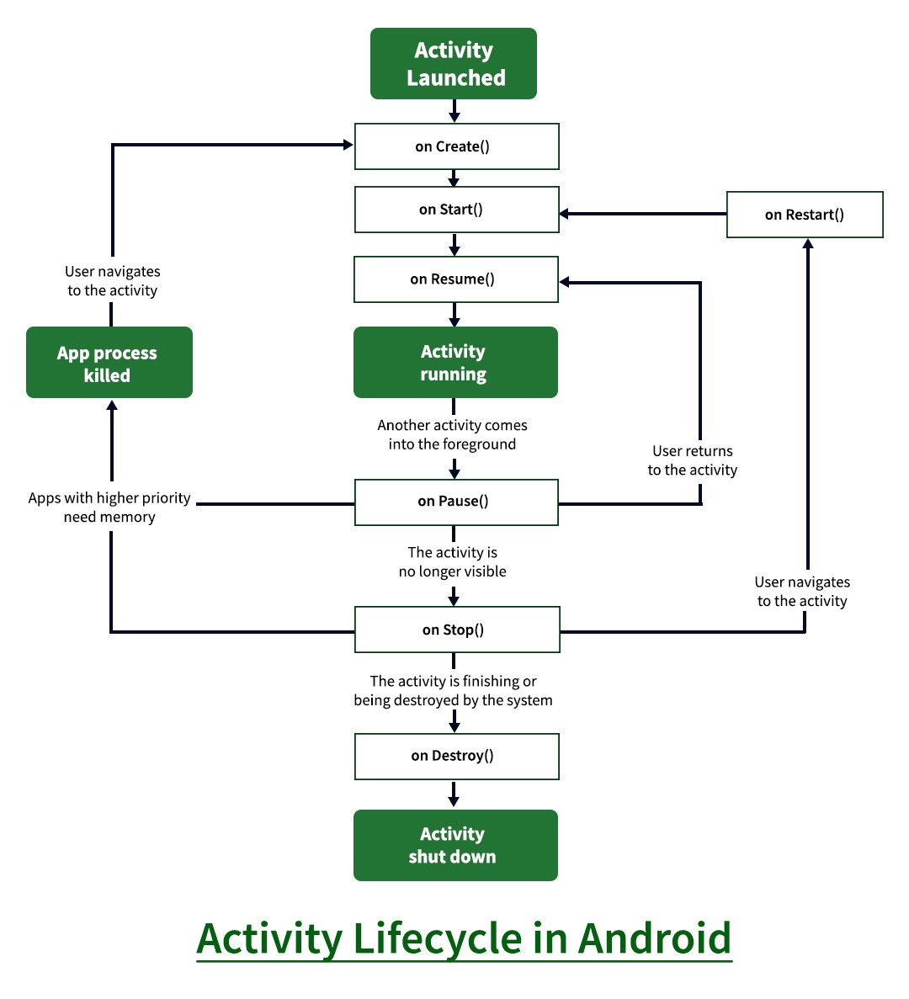
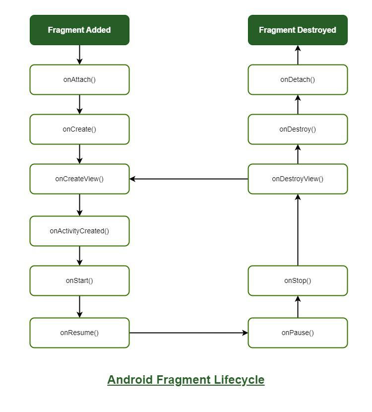

# Project Boilerplate

This boilerplate project includes the following features and integrations:

- **WorkManager**: Handles background tasks, such as syncing data, uploading files, or scheduling jobs.
- **Fastlane (CI/CD)**: Automates build, testing, and deployment processes.
- **Room Database**: Local database solution for persistent storage.
- **Automatic App Signing**: Seamlessly manages app signing for multiple build variants.
- **Navigation Groups**: Simplifies navigation between app components.
- **LiveData**: Reactive data handling for UI updates.
- **Firebase Cloud Messaging (FCM)**: Enables push notifications and messaging services.
- **Hilt (Dagger)**: Provides dependency injection for easier object management.
- **Coroutines**: Supports asynchronous programming and concurrency handling.
- **DataStore**: A modern, coroutine-based solution for storing key-value pairs or typed objects.
- **Retrofit**: A powerful HTTP client for managing API calls and network requests.
- **ViewModel**: Manages UI-related data in a lifecycle-conscious way to survive configuration changes.
- **Lottie**: Integrates animated graphics and vector-based visual effects.
- **SharedPreferences**: Provides simple, synchronous key-value storage for small amounts of data.
- **Play In-App Update**: Integrates Google's in-app update mechanism for smooth updates.
- **Facebook Ads Integration**: Supports Facebook ads for app monetization.
- **Google Ads Integration**: Adds Google ads for additional monetization options.

### Base Classes

- **Base Activity**: Provides a common structure for activities.
- **Base Fragment**: Shared functionality for fragments.
- **Base Dialog Fragment**: Common dialog fragment functionalities.
- **Base Bottom Sheet**: Standard structure for bottom sheet dialogs.
- **Etc.**: Additional shared components and utilities for code reuse.

# --------------------- Android Topic ---------------------

## Fundamentals

- **App Components**: Activities, Services, Broadcast Receivers, Content Providers
- **Application Lifecycle**: Application class, Process death handling
- **Context**: Types (Activity, Application), Use cases
- **Intents**: Explicit vs. implicit, Intent filters
- **Manifest File**: Declaring components, Permissions, Metadata
- **Android System Architecture**: Linux kernel, HAL, Binder IPC

## User Interface

- **XML Layouts**: Styles, Themes, include/merge tags
- **Views & ViewGroups**: Custom Views, Canvas/Paint, MotionLayout
- **Adaptive Layouts**: Fragments for multi-pane, WindowManager (foldables)
- **RecyclerView**: DiffUtil, ListAdapter, SnapHelper
- **Jetpack Compose**: State management, Modifiers, Navigation, Theming
- **Material Design**: Components (BottomNavigation, Snackbar), Material You (Dynamic Color)
- **Animations**: ViewPropertyAnimator, Lottie, AnimatedVectorDrawable

## Data Storage

- **SharedPreferences**: vs. DataStore (Preferences/Proto)
- **Room Database**: DAOs, Relations, Migration, Testing
- **File Storage**: Scoped Storage (MediaStore, SAF), FileProvider
- **Backup**: Auto Backup for Apps, BackupManager
- **Caching**: DiskLruCache, Retrofit caching strategies

## Networking

- **Retrofit**: Coroutine support, Interceptors, Error handling
- **OkHttp**: Cache, Timeouts, Certificate Pinning
- **Protocols**: gRPC, MQTT (IoT), GraphQL (Apollo)
- **Security**: TLS/SSL, Certificate validation, Certificate Transparency

## Permissions & Security

- **Runtime Permissions**: One-time, grouped permissions (Android 13+)
- **Biometric Auth**: Strong vs. weak biometrics, CryptoObject
- **Encryption**: AES, RSA, Android Keystore System
- **App Security**: Network Security Config, HTTPS pinning, Obfuscation (R8)
- **Privacy**: Data anonymization, Advertising ID restrictions

## Multithreading & Concurrency

- **Coroutines**: Flows, Channels, CoroutineScope (lifecycle-aware)
- **RxJava**: Observables, Subjects (alternative to coroutines)
- **WorkManager**: Chained tasks, Constraints, PeriodicWork
- **Thread Management**: ThreadPoolExecutor, Synchronization (Mutex)

## Jetpack Components

- **Navigation Component**: Deep links, Nested graphs, Compose integration
- **Data Binding**: Two-way binding, Binding adapters
- **CameraX**: Image analysis, Video capture
- **App Startup**: Initialization of components
- **Hilt**: Dependency injection (scopes, qualifiers)

## Testing

- **Unit Testing**: JUnit5, MockK, Turbine (Flow testing)
- **UI Testing**: Espresso (Idling Resources), Compose testing APIs
- **Instrumentation Tests**: UI Automator, Barista

## Multimedia

- **Camera**: Camera2 API, ML Kit (barcode scanning)
- **ExoPlayer**: Custom DRM, Adaptive streaming (HLS, DASH)
- **Image Processing**: Glide/Coil (image loading), Bitmap manipulation

## Location & Maps

- **Google Maps**: Clustering, Heatmaps, Offline maps
- **Location APIs**: FusedLocationProviderClient, Geocoding

## Firebase

- **Firebase ML**: Custom models (TensorFlow Lite), Text recognition
- **Remote Config**: A/B testing, Feature toggles
- **App Distribution**: Beta testing, Crashlytics analytics
- **Dynamic Links**: Deep linking with attribution

## Background Processing

- **Foreground Services**: Notifications, Ongoing tasks
- **JobScheduler**: vs. WorkManager (backward compatibility)
- **AlarmManager**: Exact alarms (Android 12+ restrictions)

## Sensors & Hardware

- **Sensor Types**: Proximity, Ambient light, Step counter
- **Bluetooth**: BLE (GATT), Classic Bluetooth (sockets)

## Performance Optimization

- **Memory Management**: LeakCanary, onTrimMemory()
- **Battery Optimization**: Doze mode, Background limits
- **APK Size**: R8 optimization, Dynamic feature modules
- **Tools**: Android Profiler, Systrace, Baseline Profiles

## Modern Android Development (MAD)

- **Architecture**: MVI, Unidirectional Data Flow, Clean Architecture layers
- **Kotlin**: Sealed classes, Extension functions, DSLs
- **App Startup**: Optimizing cold starts, Class preloading

## App Distribution

- **Google Play**: App signing, Target API requirements, Policy compliance
- **Alternatives**: Amazon Appstore, Huawei AppGallery
- **In-App Updates**: Flexible vs. immediate
- **Monitoring**: Vitals (ANR, crashes), Play Console metrics

## Android Customization

- **Theming**: Dark mode, Dynamic colors (Material You)
- **Animations**: Shared element transitions

## Internationalization & Accessibility

- **Localization**: Plurals, Date/number formatting
- **RTL**: Layout mirroring, android:supportsRtl

## Tools & Libraries

- **Debugging**: Stetho
- **CI/CD**: GitHub Actions, Fastlane, Firebase App Distribution

# ------------------ Interview Questions ------------------

# ------------------ Kotlin Questions ------------------

**What is the difference between `val` and `var` in Kotlin?**

- `val` is used to declare a **read-only** variable (immutable).
- `var` is used to declare a **mutable** variable, allowing reassignment.

```kotlin
val myString = "Hello World"
myString = "Hello Kotlin" // This will give a compile error

var anotherString = "Hello World"
anotherString = "Hello Kotlin" // This is valid

```

**What is the difference between `lateinit` and `lazy` in Kotlin?**
lateinit is used to initialize a `non-nullable property outside of the constructor`. lazy is used to create a `property whose value will be computed only when it is first accessed`.

```koltin
lateinit var myLateInitVar: String
if (::myLateInitVar.isInitialized) { println(myLateInitVar) }

val myLazyProperty: String by lazy {
    "Hello"
}
```

**Explain the difference between a `regular class`, an `data class` and an `object class` in Kotlin.**
A regular class is a `template for creating objects`, and an object class is a `singleton class` that can only have `one instance` throughout the `entire application`. A data class is a class that is specifically designed to `hold data`, and automatically `includes` functionality such as `equals, hashCode, and toString` methods.

```kotlin
class MyRegularClass { //regular class
    //properties and methods
}

object MyObjectClass { //object class
    //properties and methods
}

data class User(val name: String, val age: Int)
```

**Explain the use of `coroutines` in Android**
Coroutines are a `lightweight concurrency framework` that allows you to write `asynchronous code` in a more readable and manageable way. They are used to perform `long-running tasks` such as `network requests or database operations` without blocking the main thread. This makes the app `more responsive` and `improves the user experience`.

```kotlin
suspend fun getDataFromApi(): String {
    return withContext(Dispatchers.IO) {
        // perform network request
    }
}
```

**Explain `asynchronous` coding in Android**
Asynchronous refers to a method of executing tasks without waiting for the previous task to complete. Instead of blocking execution, it allows the program to continue running while waiting for long-running tasks like network calls, database operations, or file I/O to finish in the background.

**Explain the use of `sealed classes` in Kotlin.**
Sealed classes are used to represent a closed set of cases for a given type. They are used to express the possible states of a variable or object in a more explicit and readable way. They can only have a limited set of subclasses and are defined within the same file as the sealed class.

```kotlin
sealed class ApiResponse {
    data class Success(val data: Any): ApiResponse()
    data class Error(val error: String): ApiResponse()
    object Loading: ApiResponse()
}

fun handleApiResponse(response: ApiResponse) {
    when (response) {
        is ApiResponse.Success -> handleSuccess(response.data)
        is ApiResponse.Error -> handleError(response.error)
        ApiResponse.Loading -> showLoading()
    }
}
```

**What is the difference between a `Companion Object` and an `object declaration` in Kotlin?**
A Companion Object is a `singleton object` that is associated with a class, whereas an `object declaration creates a singleton object` without association to a class. Companion objects can access the private members of its associated class, whereas regular objects cannot.

```kotlin
class MyClass {
    companion object {
        fun create(): MyClass {
            // access private members of MyClass
        }
    }
}

object MySingleton {
    fun doSomething() {
        // not associated with any class
    }
}
```

**How does the `null safety` feature work in Kotlin?**
The null safety feature in Kotlin helps to prevent `null pointer exceptions` by providing a way to explicitly identify variables that can hold null values. A variable that can hold null is defined by adding a `"?"` after the variable type.

- **Explain `with`, `apply`, `let`, `also` and `run`.**
- The `with` function in Kotlin is used to call `multiple methods on an object without having to repeat the object's name for each method call`. It is especially useful for performing multiple operations on an object in a concise and readable way.

```kotlin
val myTextView = TextView(this)
with(myTextView) {
    text = "Hello"
    textSize = 20f
    setPadding(10, 10, 10, 10)
}
```

- The `apply` function in Kotlin is used to `call multiple methods on an object and return the object itself`. It is similar to the with function, but it returns the object being operated on, allowing for method chaining.

```kotlin
val myTextView = TextView(this).apply {
    text = "Hello"
    textSize = 20f
    setPadding(10, 10, 10, 10)
}
```

- The `let` function in Kotlin is used to `perform an action on an object only if the object is not null`. It is useful for `avoiding null checks` and making the code more readable. It takes a lambda expression as an argument and the object is passed to the lambda as an argument.

```kotlin
val myString: String? = "Hello"
myString?.let { print(it) } // prints "Hello"
val myString: String? = null
myString?.let { print(it) } // does nothing
```

- The scope function “also” in Kotlin is used to perform some additional actions on an object within a block of code, without changing the object itself. It allows you to execute a block of code and return the original object.

```kotlin
val list = mutableListOf<Int>()

val result = list.also {
    it.add(1)
    it.add(2)
    it.add(3)
}

println(result) // Prints the original list with added elements
```

The scope function “run” in Kotlin is used to execute a block of code on an object, similar to the “let” function. However, unlike “let”, the “run” function does not provide the object as an argument but rather as a receiver. It allows you to access the object’s properties and functions directly within the block.

```kotlin
val person = Person("John", 25)

val result = person.run {
    val formattedName = name.toUpperCase()
    "Formatted name: $formattedName, Age: $age"
}

println(result) // Prints "Formatted name: JOHN, Age: 25"
```

**What are `higher-order` functions in Kotlin?**
Higher-order functions are functions that can `accept other functions as parameters` or `return functions as results`. They allow for a more functional programming style in Kotlin.

```kotlin
fun performOperation(x: Int, y: Int, operation: (Int, Int) -> Int): Int {
    return operation(x, y)
}
val sum: (Int, Int) -> Int = { a, b -> a + b }
val result = performOperation(5, 3, sum) // result will be 8
```

**Explain the concept of `generics` in Kotlin. How are `generics used` in Android development?**
Generics in Kotlin allow you to `create reusable components` that can `work with different types`. They provide type `safety and avoid the need for type casting`. Generics are widely used in Android development, for example, when working with collections like List<T> or when creating adapters for RecyclerViews.

```kotlin
fun <T> getListSize(list: List<T>): Int {
    return list.size
}

val stringList: List<String> = listOf("A", "B", "C")
val size = getListSize(stringList) // size will be 3
```

**What is a `primary constructor` in Kotlin? How is it `different` from `secondary constructors`?**
A primary constructor is declared in the `class header and is part of the class declaration`. It can define properties and receive parameters. On the other hand, secondary constructors are `additional constructors declared inside the class body`. They provide alternative ways to initialize the class.

```kotlin
class Person(val name: String, val age: Int) {
    constructor(name: String) : this(name, 0) {
        // Secondary constructor
    }
}
```

**what is type inference in Kotlin. How does it help in reducing code verbosity?**
Type inference in Kotlin allows the `compiler to automatically determine the type of a variable` or expression based on its context. It `eliminates the need for explicitly declaring` the type, reducing code verbosity.

```kotlin
val number = 42 // The compiler infers the type as Int
val list = listOf(1, 2, 3) // The compiler infers the type as List<Int>
```

**How do you `handle exceptions` in Kotlin? Explain the `try-catch-finally` block.**
If an exception occurs, it is `caught` and `handled` in the `catch` block. The finally block is optional and is executed regardless of whether an exception occurred. Here's an example:

```kotlin
try {
    // Code that might throw an exception
} catch (e: Exception) {
    // Exception handling
} finally {
    // Code that will always execute
}
```

**What are the `visibility modifiers` available in Kotlin? Explain each one briefly.**
Kotlin provides four visibility modifiers:

- `private`: Visible only within the same file.
- `protected`: Visible within the same file and subclasses.
- `internal`: Visible within the same module.
- `public`: Visible everywhere (default if no modifier is specified).

- **What is the difference between a `lambda expression` and an `anonymous function` in Kotlin?**
  Both lambda expressions and anonymous functions allow you to define function literals in Kotlin. The main difference is in the syntax. Lambda expressions are `surrounded by curly braces` and have `implicit return`, while anonymous functions have the fun keyword, `explicit return types`, and `can have multiple return statements`.

```kotlin
val lambda: (Int, Int) -> Int = { a, b -> a + b }

val anonymousFun = fun(a: Int, b: Int): Int {
    return a + b
}
```

**Non-Null Assertion, Safe Casts, Elvis Operator and Safe Calls:**

```kotlin
text!!.length // non-null assertion
value as? String // safe cast
val length: Int = text?.length ?: 0 //elvis Operator
val length: Int? = text?.length // safe call
```

**What is the difference between a list and an array in Kotlin?**
In Kotlin, a list is an ordered collection that can store elements of any type, while an array is a fixed-size collection that stores elements of a specific type. Here are the main differences:

- **Size:** Lists can dynamically grow or shrink in size, whereas arrays have a fixed size that is determined at the time of creation.
- **Type Flexibility:** Lists can store elements of different types using generics, allowing for heterogeneity. Arrays, on the other hand, are homogeneous and can store elements of a single type.
- **Modification:** Lists provide convenient methods for adding, removing, or modifying elements. Arrays have fixed sizes, so adding or removing elements requires creating a new array or overwriting existing elements.
- **Performance:** Arrays generally offer better performance for direct element access and modification, as they use contiguous memory locations. Lists, being dynamic, involve some level of overhead for resizing and maintaining their internal structure.

- **What is the difference between an `immutable` and a `mutable` list in Kotlin?**
  In Kotlin, an immutable list (read-only list) is created using the listOf() function, and its elements cannot be modified once the list is created. On the other hand, a mutable list can be modified by adding, removing, or modifying its elements using specific functions.

```kotlin
val immutableList: List<Int> = listOf(1, 2, 3) // Immutable list
val mutableList: MutableList<Int> = mutableListOf(4, 5, 6) // Mutable list

immutableList[0] = 10 // Error: Immutable list cannot be modified

mutableList[0] = 10 // Mutable list can be modified
mutableList.add(7) // Add an element to the mutable list
mutableList.removeAt(1) // Remove an element from the mutable list
```

**Explain the concept of `extension functions` in Kotlin.**
Extension functions in Kotlin allow you to `add new functions to existing classes without modifying their source code`. They provide a way to extend the functionality of a class without the need for inheritance or modifying the original class.

```kotlin
fun String.addExclamation(): String {
    return "$this!"
}

val message = "Hello"
val modifiedMessage = message.addExclamation() // Extension function usage

println(modifiedMessage) // Output: Hello!
```

**What is the difference between `companion objects` and `static members` in Java?**
In Java, static members belong to the class itself, while companion objects in Kotlin are separate objects that are closely related to a class. Here are the main differences:

- **Syntax:** In Java, static members are declared using the `static` keyword, while companion objects in Kotlin are declared using the `companion` keyword within the class.
- **Access:** Static members in Java can be accessed directly using the class name, whereas companion objects in Kotlin are accessed through the name of the containing class.
- **Inheritance:** Static members in Java are inherited by subclasses. Subclasses can access static members using the class name. However, static members are not polymorphic and cannot be overridden by subclasses. They are associated with the class itself, not with instances.
- **Extension Functions:** Kotlin companion objects can contain extension functions that are applicable to the class, providing a convenient way to add additional behavior.
- **Object-oriented vs. Functional:** Static members in Java are primarily used for procedural programming and sharing common resources among instances, while companion objects in Kotlin blend object-oriented and functional programming concepts.

```Java
public class MyClass {
    public static int myStaticField = 10;
    public static void myStaticMethod() {
        // Static method implementation
    }
}
```

```Kotlin
class MyClass {
    companion object {
        val myStaticField = 10
        fun myStaticMethod() {
            // Static method implementation
        }
    }
}
```

**Explain the suspend modifier in Kotlin.**
The `suspend` modifier in Kotlin is used to mark functions or lambda expressions that can be suspended and resumed later without blocking the thread. It is a fundamental concept in coroutine-based programming.

```kotlin
suspend fun fetchData(): String {
    delay(1000L)
    return "Data fetched"
}

fun main() = runBlocking {
    val result = fetchData()
    println(result)
}
```

**What is the purpose of the withContext() function in Kotlin coroutines?**
The `withContext()` function in Kotlin coroutines is used to switch the coroutine’s context to a different dispatcher while suspending the current coroutine.

```kotlin
suspend fun fetchFromNetwork(): String {
    return withContext(Dispatchers.IO) {
        // Perform network request
        // Return result
    }
}
```

**What is a flow in Kotlin coroutines?**
A flow in Kotlin coroutines is a cold asynchronous stream of data that can emit multiple values over time. It is designed to handle sequences of values that are computed asynchronously and lazily. Flows are similar to sequences, but they are asynchronous and can handle potentially infinite sequences of data. They provide built-in operators to transform and combine data streams.

```kotlin
import kotlinx.coroutines.*
import kotlinx.coroutines.flow.*

fun fetchData(): Flow<Int> = flow {
    for (i in 1..5) {
        delay(1000L)
        emit(i)
    }
}

fun main() = runBlocking {
    fetchData()
        .map { it * 2 }
        .collect { value ->
            println(value)
        }
}
```

**Functional programming in Kotlin.**
Functional programming in Kotlin encourages the following principles:

- **Immutable Data:** Emphasizes the use of immutable data structures, where objects cannot be modified after creation. This helps in writing code that is more predictable and avoids issues related to mutable state.
- **Pure Functions:** Functions that produce the same output for the same input, without modifying any external state or causing side effects. Pure functions are easier to reason about and test, as they only depend on their input parameters.
- **Higher-Order Functions:** Functions that can accept other functions as parameters or return functions as results. Higher-order functions enable code reuse, abstraction, and the ability to express complex behavior in a more concise way.

```kotlin
val numbers = listOf(1, 2, 3, 4, 5)

val evenNumbers = numbers.filter { it % 2 == 0 }
val doubledNumbers = evenNumbers.map { it * 2 }
val sum = doubledNumbers.reduce { acc, value -> acc + value }

println(sum) // Prints the sum of doubled even numbers: 12
```

**Explain the concept of delegates in Kotlin.**
Delegates in Kotlin provide a way to delegate the implementation of properties or functions to another object. They allow you to reuse common behavior or add additional functionality to existing objects without the need for inheritance.

```kotlin
val myLazyProperty: String by lazy {
    println("Initializing myLazyProperty")
    "Hello, Kotlin!"
}

val args: SecondFragmentArgs by navArgs()

by  -> Delegation
```

**What is the difference between init and constructor in Kotlin?**
`init` is an initialization block that is executed when an instance of a class is created. It is used to initialize properties or perform other setup operations. The `primary constructor` and any `secondary constructors` are responsible for `creating the instance`, while the `init block handles the initialization logic`. The main difference is that the init block is always executed regardless of which constructor is used.

```kotlin
class Person(name: String) {
    val greeting: String

    init {
        greeting = "Hello, $name!"
        println("Person initialized")
    }
}

fun main() {
    val person = Person("John") // Output: Person initialized

    println(person.greeting) // Output: Hello, John!
}
```

**What is the difference between invariance, covariance, and contravariance in Kotlin generics?**
In Kotlin generics, `invariance`, `covariance`, and `contravariance` define how subtyping works for generic types.

- `Invariance` means that there is no subtyping relationship between different generic instantiations.
  For example, a Box<String> is not considered a subtype of Box<Any>. Invariance ensures type safety but limits flexibility.
- `Covariance` allows a subtype relationship between generic instantiations that preserve the direction of subtyping. It allows more flexible use of generic types. In Kotlin, you can declare covariance using the out keyword.
- `Contravariance` allows a subtype relationship that reverses the direction of subtyping. It allows more flexible use of generic types in certain scenarios. In Kotlin, you can declare contravariance using the in keyword.

```kotlin
open class Animal
class Dog : Animal()

interface Container<out T> {
fun getItem(): T
}

interface Processor<in T> {
fun process(item: T)
}

fun main() {
    val dogContainer: Container<Dog> = object : Container<Dog> {
    override fun getItem(): Dog {
        return Dog()
    }
}

    val animalContainer: Container<Animal> = dogContainer // Covariance

    val animalProcessor: Processor<Animal> = object : Processor<Animal> {
        override fun process(item: Animal) {
            println("Processing animal: $item")
        }
    }

    val dogProcessor: Processor<Dog> = animalProcessor // Contravariance

}
```

**Explain the concept of `typealias` in Kotlin.**
typealias is used to `provide an alternative name for an existing type`. It allows you to create a new name for a complex or lengthy type, making the code more readable and maintainable.

```kotlin
typealias EmployeeId = String

class Employee(val id: EmployeeId, val name: String)

fun main() {
    val employee = Employee("123", "John Doe")
    println(employee.id) // Output: 123
}
```

**What are `inline functions` in Kotlin?**
Inline functions in Kotlin are `functions that are expanded or “inlined” at the call site during compilation. Instead of creating a separate function call, the code of the inline function is directly inserted at each call site`. This can improve performance by reducing function call overhead. However, it may also increase the size of the generated bytecode. Inline functions are declared using the inline keyword.

```kotlin
inline fun calculateSum(a: Int, b: Int): Int {
    return a + b
}

fun main() {
    val sum = calculateSum(3, 4)
    println(sum) // Output: 7
}
```

**Explain the concept of `tail recursion` in Kotlin.**
Tail recursion in Kotlin is a technique where a `recursive function calls itself as its last operation. It allows the compiler to optimize the recursion into an efficient loop, preventing stack overflow errors`. To enable tail recursion optimization, the recursive function must be declared with the tailrec modifier.

```kotlin
tailrec fun factorial(n: Int, acc: Int = 1): Int {
return if (n == 0) {
        acc
    } else {
        factorial(n - 1, acc \* n)
    }
}

fun main() {
val result = factorial(5)
    println(result) // Output: 120
}
```

**What is the use of the @JvmStatic annotation in Kotlin?**
The @JvmStatic annotation in Kotlin is used when `interoperating with Java code`. It is applied to a companion object's member function or `property to generate a static equivalent in the compiled Java bytecode`. It allows the Kotlin code to be `called from Java as if it were a static method` or field.

```kotlin
class Utils {
companion object {
@JvmStatic
fun doSomething() {
        println("Doing something")
        }
    }
}
```

**What is the difference between “==” and “===” operators in Kotlin?**
In Kotlin, the `==` operator is used for `structural equality comparison`, which checks if the values of `two objects are equal`. On the other hand, the `===` operator is used for `referential equality comparison`, which checks if two `references point to the same object in memory`.

```kotlin
val a = "Hello"
val b = "Hello"
val c = a

println(a == b) // Output: true (structural equality)
println(a === b) // Output: true (referential equality)
println(a === c) // Output: true (referential equality)
```

**What is the purpose of the operator modifier in Kotlin?**
The operator modifier in Kotlin is used to `overload or define custom behavior for operators`. It allows you to provide custom implementations for built-in operators such as `+, -, \*, /, ==, !=`, etc. By using the operator modifier, you can define how your objects should behave when operated upon with specific operators. Here's an

```kotlin
data class Point(val x: Int, val y: Int) {
operator fun plus(other: Point): Point {
return Point(x + other.x, y + other.y)
}
}

fun main() {
val p1 = Point(1, 2)
val p2 = Point(3, 4)
val sum = p1 + p2
println(sum) // Output: Point(x=4, y=6)
}
```

**What is the difference between extension functions and member functions in Kotlin?**

- **Extension functions** in Kotlin allow you to `add new functions to existing classes without modifying their source code`.
- **Member functions**, on the other hand, are `defined inside the class and can access its properties and functions directly`. They are part of the class’s interface and can be called on instances of the class using the dot notation.

```kotlin
// Extension function
fun String.isPalindrome(): Boolean {
val reversed = this.reversed()
return this == reversed
}

// Member function
class Person(val name: String) {
    fun introduce() {
        println("Hello, my name is $name")
    }
}

fun main() {
val text = "radar"
println(text.isPalindrome()) // Output: true

    val person = Person("John")
    person.introduce() // Output: Hello, my name is John

}
```

**Explain the concept of the `“this”` expression in Kotlin.**
The this expression in Kotlin refers to the `current instance of the class`.

```kotlin
class Person {
var name: String = "John"

    fun printName() {
        println("My name is ${this.name}")
    }

}
```

fun main() {
val person = Person()
person.printName() // Output: My name is John
}

**Explain the concept of default arguments in Kotlin.**
Default arguments in Kotlin allow you to `define default values` for function parameters. When calling a function, if an argument is not `provided for a parameter with a default value, the default value will be used`. Default arguments make it more convenient to call functions with a varying number of arguments, as you can omit the arguments with default values.

```kotlin
fun greet(name: String = "World") {
println("Hello, $name!")
}

fun main() {
greet() // Output: Hello, World!
greet("John") // Output: Hello, John!
}
```

**Explain the concept of `function references` in Kotlin.**
Function references in Kotlin allow you to refer to a `function by its name without invoking it`. They provide a way to pass functions as arguments or store them in variables. Function references can be useful when you want to treat a `function as a first-class citizen and pass it around as data`.

```kotlin
fun greet() {
println("Hello, World!")
}

val functionReference = ::greet

fun main() {
functionReference() // Output: Hello, World!
}
```

**What is the purpose of the downTo keyword in Kotlin?**
The `downTo` keyword in Kotlin is `used in conjunction with the .. range operator to create a range of values` in descending order. It is commonly used in for l`oops to iterate over a range of values` from a higher value down to a lower value.

```kotlin
for (i in 10 downTo 1) {
    println(i)
}
```

**Explain the concept of the until keyword in Kotlin.**
The until keyword in Kotlin is used in `conjunction with the .. range operator` to create a range of values excluding the end value. It defines a r`ange from the starting value up to, but not including, the end value.` The until range is often used in loop statements to iterate over a range of values.

```kotlin
for (i in 1 until 5) {
    println(i)
}
```

**Explain the concept of the internal visibility modifier in Kotlin.** need clearity
The internal visibility modifier in Kotlin is used to restrict the visibility of a declaration to the same module. It allows the declaration to be accessed from any code within the same module but not from outside the module. A module is defined as a set of Kotlin files compiled together.

```kotlin
ModuleA.kt:
internal class InternalClass {
    fun doSomething() {
        println("Doing something internally")
    }
}
```

**What is the difference between first() and firstOrNull() functions in Kotlin?**
The first() and firstOrNull() functions are used to `retrieve the first element of a collection or a sequence`. The difference between them lies in how they handle empty collections or sequences.

- `first()`: This function `returns the first element of a collection` or `sequence and throws a NoSuchElementException` if the collection or sequence is empty.

```kotlin
val numbers = listOf(1, 2, 3, 4, 5)

val firstNumber = numbers.first()
println(firstNumber) // Output: 1
```

`firstOrNull()`: This function returns `the first element of a collection or sequence, or null` if the collection or sequence is empty.

```kotlin
val numbers = emptyList<Int>()

val firstNumber = numbers.firstOrNull()
println(firstNumber) // Output: null
```

**Explain the concept of `crossinline` in Kotlin.** need nore clearifcation
The crossinline modifier in Kotlin is used in the context of a higher-order function to indicate that the passed lambda expression cannot contain non-local returns. It is used to enforce that the lambda expression is executed in the calling context and cannot terminate the enclosing function or return from it.

```kotlin
inline fun higherOrderFunction(crossinline lambda: () -> Unit) {
    val runnable = Runnable {
        lambda()
    }
    runnable.run()
}

fun main() {
    higherOrderFunction {
        // Non-local return is not allowed here
        return@higherOrderFunction
    }
}
```

**What is the use of the `requireNotNull` function in Kotlin?**
The requireNotNull function in Kotlin is used to `check whether a given value is not null`. It throws an `IllegalArgumentException` if the `value is null` and returns the non-null value otherwise. It is often used to ensure that a required value is not null and to provide meaningful error messages in case of null values.

```kotlin
fun printName(name: String?) {
    val nonNullName = requireNotNull(name) { "Name must not be null" }
    println("Name: $nonNullName")
}

fun main() {
    printName("John") // Output: Name: John
    printName(null) // Throws IllegalArgumentException with the specified error message
}
```

**Explain the concept of top-level functions in Kotlin.**
Top-level functions in Kotlin are functions that are `declared outside of any class or interface`. They are defined at the top level of a file, making them accessible from any part of that file and any other files in the same module. Top-level functions `provide a way to organize and encapsulate related logic that doesn’t belong to a specific class`.

```kotlin
File: MathUtils.kt
package com.example.utils

fun addNumbers(a: Int, b: Int): Int {
    return a + b
}

fun multiplyNumbers(a: Int, b: Int): Int {
    return a * b
}
```

**Explain the concept of `inlining` in Kotlin.**
Inlining is a mechanism in Kotlin that `optimizes the execution of higher-order functions by eliminating the runtime overhead of function calls`. When a higher-order function is marked with the inline keyword, the `Kotlin compiler replaces the function call with the actual code of the function at the call site`. This reduces the function call overhead and can result in performance improvements.

```kotlin
inline fun calculateResult(a: Int, b: Int, operation: (Int, Int) -> Int): Int {
    return operation(a, b)
}

fun main() {
    val result = calculateResult(5, 3) { x, y -> x + y }
    println(result) // Output: 8
}
```

**How does `Kotlin handle SAM (Single Abstract Method) conversions` for Java interoperability?**
Kotlin allows SAM conversions, where functional interfaces in Java can be seamlessly used as lambda expressions in Kotlin. This simplifies the integration of Kotlin with Java libraries that heavily use functional interfaces, promoting smooth interoperability between the two languages.

```kotlin
fun setClickListener(listener: ClickListener) {
    listener.onClick("Button clicked")
}

// Using SAM conversion - Passing lambda instead of an object
setClickListener { message ->
    println("Lambda: $message")
}
```

**What are `Kotlin Contracts`, and how do they `improve code optimization`?**
Kotlin Contracts are `annotations that developers can use to provide additional information to the compiler about the expected behavior of functions`. By specifying contracts, developers can guide the compiler in making more informed decisions during optimization, resulting in potentially more efficient and performant code.

**How do you perform `string interpolation` in Kotlin?**
String interpolation in Kotlin allows you to embed expressions or variables directly within string literals. It provides a convenient way to construct strings by inserting values or expressions into specific locations within the string.

```kotlin
fun main() {
    val name = "John"
    val age = 30
    val message = "My name is $name and I am $age years old."
    println(message) // Output: My name is John and I am 30 years old.
}
```

## ------------------ Android Points ------------------

**What’s Activity in Android?**
Activity `represents a single screen with a user interface`. It serves as the entry point for interacting with the app and can host UI elements like buttons, text fields, and images. Each Android app typically consists of multiple activities that work together to provide a seamless user experience.

**What are the components of the Android Application?**
There are some necessary `building blocks` that an `Android application consists` of. These loosely coupled components are bound by the application manifest file which contains the description of each component and how they interact. The four main components of Android applications are:

- `Activities`
- `Services`
- `Content Providers`
- `Broadcast Receiver`
- `Intents`


**What is Toast in Android?**
A Toast is a `short alert message shown on the Android screen for a short interval of time`. Android Toast is a short popup notification that is used to display information when we perform any operation in our app. It disappears automatically.

**What’s Service in Android?**
Services in Android are a special component that facilitates an application to `run in the background in order to perform long-running operation tasks`. 

**What is a `Content Provider` in Android?**
A Content Provider is a crucial component in Android that acts as a `central repository for storing and managing application data`. It allows apps to securely `share, access, and modify data` from other apps while maintaining proper permissions and security.

```kotlin
val contentUri = Uri.parse("content://com.example.provider/users")
val cursor = contentResolver.query(contentUri, null, null, null, null)
```

**What is a `Broadcast Receiver` in Android?**
A Broadcast Receiver is a component in Android that listens for `system-wide or app-specific events` (broadcasts) and responds when they occur. Events include `device boot`, `incoming SMS`, `battery changes`, or `airplane mode activation`.

- **Types of Broadcast Receivers:**
- **Static Broadcast Receiver** – Declared in the AndroidManifest.xml, works even if the app is closed.
- **Dynamic Broadcast Receiver** – Registered at runtime, works only when the app is running or minimized.

**What is `Gradle` in Android?**
Gradle is an open-source build automation tool used in Android for `building, testing, and deployment`. It `automates tasks like compiling code, managing dependencies, and generating APKs`.

**What is a Fragment in Android?**
A Fragment is a `reusable UI component` that represents a portion of an Activity. It helps create `flexible, modular, and adaptive UI designs` that adjust to different screen sizes. Fragments make it easier to build `multi-pane layouts` and `improve app scalability`.

**What’s  `RecyclerView in Android` & How it works?**

RecyclerView is a ViewGroup added to the Android Studio as a `successor of the GridView and ListView`. It is an `improvement` on both of them. It has been created to make possible construction of any lists with XML layouts as an item that can be `customized vastly` while `improving the efficiency of ListViews and GridViews`. This improvement is achieved by recycling the views which are out of the visibility of the user. For example, if a user scrolled down to a position where items 4 and 5 are visible; items 1, 2, and 3 would be cleared from the memory to reduce memory consumption. 


**What’s the Difference Between `Intent and Intent filters`?**

An Intent is an `object passed to Context.startActivity()`, Context.startService() or Activity.startActivityForResult() etc. to launch an activity or get an existing activity to do something new. On the other hand, an `Intent filter` describes the `capability of the component`(like activities, services, and broadcast receivers). 


**What is the AndroidManifest.xml?**

Every project in Android includes a manifest file, which is `AndroidManifest.xml`, `stored` in the `root directory` of its project hierarchy. The manifest file is an important part of our app because it defines the structure and metadata of our application, its `components`, and its `requirements`. This file includes nodes for each of the `Activities, Services, Content Providers, and Broadcast Receivers` that make the application and using `Intent Filters and Permissions determines` how they coordinate with each other and other applications. The manifest file also specifies the application metadata, which includes its `icon`, `themes`, etc.


 **Activity Lifecycle in brief.**

These are the different stages of the Activity Lifecycle:


`onCreate():` It is `called when the activity is first created`. This is where all the static work is done like creating views, binding data to lists, etc.
`onStart():` It is invoked `when the activity is visible to the user`. It is followed by onResume() if the activity is invoked from the background.
`onRestart():` It is invoked after the `activity has been stopped and prior to its starting stage` and thus is always followed by onStart() when any activity is revived from background to on the screen.
`onResume():` It is invoked when `the activity starts interacting with the user`. At this point, the activity is at the top of the activity stack, with a user interacting with it.
`onPause():` It is invoked `when an activity is going into the background but has not yet been killed`. It is a counterpart to onResume()
`onStop():` It is invoked when the `activity is not visible to the user`. It is followed by onRestart() when the activity is revoked from the background, followed by onDestroy() when the activity is closed or finished, and nothing when the activity remains on the background only.
`onDestroy()`: The final call `received before the activity is destroyed`. This can happen either because the activity is finished (when finish() is invoked) or because the system is temporarily destroying this instance of the activity to save space.


**Why do we need to call `setContentView() in onCreate()` of Activity class?**

The reason for doingso is that the activity life cycle onCreate() method is `called only once`. And this is the big reason we need to call the `setContentView() in onCreate()`. And it will be `inefficient to call` this function in `onResume(), onStart()`, and somewhere else because those methods are called more than once. 

**Explain the `Fragment Lifecycle` in Brief**



## Difference between Fragment and Activity

| Feature              | Activity | Fragment |
|----------------------|---------|---------|
| **Definition**       | An application component that provides a user interface for interaction. | A UI component that is part of an Activity, contributing to its UI. |
| **Independence**     | Not dependent on a Fragment. | Dependent on an Activity; cannot exist independently. |
| **Manifest Requirement** | Must be declared in `AndroidManifest.xml`. | No need to declare in the manifest file. |
| **Multi-Screen UI**  | Cannot create a multi-screen UI alone. | Enables multi-screen UI by combining multiple fragments in one activity. |
| **Existence**        | Can exist without a Fragment. | Cannot exist without an Activity. |
| **Project Structure** | Difficult to manage if the project has only activities. | Easier to manage and scale using fragments. |
| **Lifecycle Handling** | Lifecycle is managed by the OS. | Lifecycle is managed by the hosting Activity. |
| **Performance**      | Heavier component. | Lightweight compared to Activity. |
| **Reusability**       | Not reusable. | Highly reusable. |


**What’s `Context` in Android?**

The context in Android can be understood as something which gives us the `context of the current state of our application`. We can break the context and its use into three major points: 

- It allows us to access resources.
- It allows us to interact with other Android components by sending messages.
- It gives you information about your app environment.

**There are mainly two types of context available in Android.**

- Application Context
- Activity Context

## Difference Between View and ViewGroup in Android

| Feature | View | ViewGroup |
|---------|------|----------|
| **Definition** | A simple rectangular UI element that responds to user actions. | An invisible container that holds Views and other ViewGroups. |
| **Hierarchy** | Superclass of all UI components like `TextView`, `EditText`, `ListView`, etc. | A collection of Views (`TextView`, `EditText`, `ListView`, etc.), acting as a container. |
| **Purpose** | Represents UI elements like buttons, text boxes, and widgets. | Organizes Views and ViewGroups to structure the UI layout. |
| **Examples** | `EditText`, `Button`, `CheckBox`, etc. | `LinearLayout`, `RelativeLayout`, `ConstraintLayout` (which contain Views inside). |
| **Class Reference** | Refers to `android.view.View`. | Refers to `android.view.ViewGroup`. |
| **Base Class** | `android.view.View` is the base class of all UI components. | `ViewGroup` is the base class for all Layouts. |


**Describe the architecture of your last app.**
To structure the project’s code and to give it a modular design(separated code parts), architecture patterns are applied to separate the concerns. The most popular Android architectures used by developers are the following:

`MVC (Model — View — Controller)`
`MVP (Model — View — Presenter)`
`MVVM (Model — View — ViewModel)`


## MVC vs MVP vs MVVM Architecture and Which One to Choose?

| Feature | MVC (Model-View-Controller) | MVP (Model-View-Presenter) | MVVM (Model-View-ViewModel) |
|---------|----------------------------|----------------------------|----------------------------|
| **Evolution** | One of the oldest software architectures. | Advanced version of MVC. | Industry-recognized architecture pattern. |
| **Coupling** | UI (View) and Model are tightly coupled. | Presenter acts as an intermediary to reduce dependency between View and Model. | Uses data binding for event-driven communication, ensuring a clear separation of business logic and UI. |
| **Relationships** | One-to-many: One Controller can handle multiple Views. | One-to-one: One Presenter manages one View. | One-to-many: Multiple Views can be mapped to a single ViewModel. |

### **Which One Should We Choose?**
- **MVC**: Best for **small-scale projects** due to its simplicity.  
- **MVP**: Suitable for **both simple and complex applications**.  
- **MVVM**: Ideal for **large-scale projects** but may be overkill for smaller ones.  


**Describe `MVVM`**

`Model — View — ViewModel (MVVM)` is the industry-recognized software architecture pattern that `overcomes all drawbacks of MVP and MVC` design patterns. MVVM suggests separating the data presentation logic(Views or UI) from the core business logic part of the application. 

The separate code layers of MVVM are:
- `Model:` This layer is responsible for the abstraction of the data sources. Model and ViewModel work together to get and save the data.
- `View:` The purpose of this layer is to inform the ViewModel about the user’s action. This layer observes the ViewModel and does not contain any kind of application logic.
- `ViewModel:` It exposes those data streams which are relevant to the View. Moreover, it serves as a link between the Model and the View.


**How to Reduce APK size in Android?**

- Remove unused sources
- Use of Vector Drawables
- Reuse your code
- Compress PNG and JPEG files
- Use of Lint
- Use images in WebP file format
- Use of proguard
- Use of ShrinkResources
- Limit the usage of external libraries
- Use the Android Size Analyzer tool
- Generate App Bundles instead of APK
- Use of Resconfigs

**What’s the `Android jetpack` and its `Key Benefits`?**

Jetpack is nothing but a `set of software components, libraries, tools`, and guidance to help in developing great Android apps. Google launched Android Jetpack in 2018. Key Benefits of Android Jetpack

- Forms a recommended way for app architecture through its components
- Eliminate boilerplate code
- Simplify complex task
- Provide backward compatibility as libraries like support are unbundled from Android API and are re-packaged to androidx.* package
- Inbuilt productivity feature of the Kotlin Integration


**What’s `Jetpack Compose` and its Benefits?**

Jetpack Compose is a `modern UI toolkit` recently launched by Google which is used for building native Android UI. It simplifies and accelerates the UI development with less code, Kotlin APIs, and powerful tools. 

- Declarative
- Compatible
- Increase development speed
- Concise and Idiomatic Kotlin
- Easy to maintain
- Written in Kotlin

**What are the `Architecture Components` of Android?**
Architecture Components could be classified as follows: 
- Room
- WorkManager
- Lifecycle
- ViewModel
- LiveData
- Navigation
- Paging
- Data Binding

**How to Improve RecyclerView Scrolling Performance in Android?**

- Set a specific width and height to ImageView in RecyclerView items
- Avoid using NestedView
- Use the setHasFixedsize method
- Use the image loading library for loading images
- Do less work in the OnBindViewHolder method
- Use the NotifyItem method for your RecyclerView

**What’s `Retrofit` in Android?**

Retrofit is a `type-safe REST client built by square for Android` and Java which intends to make it simpler to expand RESTful web services. Retrofit uses `OkHttp as the system’s administration layer` and is based on it. Retrofit `naturally serializes the JSON reaction utilizing a POJO` (PlainOldJavaObject) which must be characterized as cutting edge for the JSON Structure. To serialize JSON we require a `converter to change it into Gson first`. Retrofit is much simpler than other libraries; we don’t have to parse our JSON. It directly returns objects but there is one 

`disadvantage`: it doesn’t provide support to load images from the server, but we can use Picasso for the same. 


**What are the `reasons your Android app` is legging?**
- You are doing too much on the main thread
- Your asset files are huge
- You are using an outdated SDK version
- You are using bad libraries
- The speed of the network
- Chatty conversations
- `Your code is inefficient`


**What is `ANR` and How can it be `Prevented in Android`?**

ANR stands for `Application Not Responding`. An ANR will occur `if you’re running a process on the UI thread which takes an extended time`, usually around `5 seconds`. During this point, the `GUI (Graphical User Interface) will lock up which can end in anything the user presses won’t be actioned`. After the 5 seconds approx. has occurred, if the `thread still hasn’t recovered then an ANR dialogue box` is shown informing the user that the appliance isn’t responding and can give the user the choice to either wait, in the hope that the app will eventually recover, or to force close the app.

`Stop doing heavy tasks on the main thread`. Instead, use worker threads such as IntentService, AsyncTask Handler, or another Thread simply. Detecting where ANRs happen is straightforward if it’s a permanent block (deadlock acquiring some locks for instance), but harder if it’s just a short-lived delay. First, re-evaluate your code and appearance for vulnerable spots and long-running operations.

**What is `Android NDK` and why is it useful?**
The NDK (Native Development Kit) is a tool that `allows you to program in C/C++ for Android devices`. It provides platform libraries one can use to manage native activities and access physical device components, such as sensors and touch input.
Squeeze extra performance out of a device to achieve low latency or `run computationally intensive applications`, such as `games or physics simulations`. Reuse your own or other developers’ C or C++ libraries.

**Explain the `JUnit` test in brief.**

JUnit is a `“Unit Testing” framework` for Java Applications which is already included by default in Android studio. It is an `automation framework for Unit as well as UI Testing`. It contains annotations such as `@Test, @Before, @After,` etc. Here we will be using only @Test annotation to keep the article easy to understand.


**What’s `LiveData` in `Android Architecture Component` and its Advantages?**
LiveData component is an observable data holder class i.e, the contained value can be observed. `LiveData is a lifecycle-aware component` and thus `it performs its functions according to the lifecycle state of other application components`. Further, if the `observer’s lifecycle state is active i.e., either STARTED or RESUMED`, only then LiveData updates the app component. LiveData always checks the `observer’s state before making any update` to ensure that the observer must be active to receive it. If the observer’s lifecycle state is destroyed, `LiveData is capable of removing it, and thus it avoids memory leaks.` It makes the task of data synchronization easier.

**Advantages of `LiveData component`:**

- UI is updated as per the appropriate change in the data
- It removes the stopped or destroyed activities which reduce the chance of app crash
- No memory leaks as LiveData is a lifecycle-aware component.

.jpg)


**What’s `Data Binding` in Android?**
Data Binding library is a support library that provides the feature of `binding UI components in an activity/fragment to the data sources of the application`. The library carries out this binding task in a declarative format and not in a programmatic way. Below is an example to understand the working of this library accurately:
To find a TextView widget and bind it to the userName property of the ViewModel variable, the findViewById() method is called:

```kotlin
TextView textView = findViewById(R.id.sample_text);
textView.setText(viewModel.getUserName());

```
```kotlin
After using the Data Binding library, the above code changes by using the assignment expression as follows:
<TextView
android:text=”@{viewmodel.userName}” />
```
**Advantages of Data Binding Component:**

- Make code simpler and easy to maintain by removing UI frameworks called in the activity.
- Allows classes and methods to observe changes in data
- Allows to make objects and fill which works as collection observables.


**Room in Android Architecture Component.**

The requirement of a database in Android is fulfilled by SQLite from the very beginning. However, it comes with some severe drawbacks like not checking the queries at compile-time, it does not save plain-old-Java Objects(commonly referred to as POJOs). Developers also need to write a lot of boilerplate code to make the SQLite database work in the Android OS environment. The Room component comes into the picture as an SQLite Object Mapping Library which overcomes all the mentioned challenges. `Room converts queries directly into objects, checks errors in queries at the compile-time, and is also capable of persisting the Java POJOs.` 

Moreover, `it produces LiveData results/observables from the given query result.` Because of this versatile nature of the Room component, Google officially supports and recommends developers to use it. The Room consists of the following sub-components:

`Entity:` It is the `annotated class for which the Room creates a table within the database`. The field of the class represents columns in the table.
`DAO(Data Access Object):` It is responsible for `defining the methods` to access the database and to perform operations.
`Database:` It is an `abstract class that extends RoomDatabase class` and it serves as the main `access point to the underlying app’s` relational data.


**ViewModel in Android**
ViewModel is `one of the most critical classes of the Android Jetpack Architecture Component` that support data for UI components. Its purpose is to `hold and manage the UI-related data`. Moreover, its `main function is to maintain the integrity and allows data to be serviced during configuration changes like screen rotations`. Any kind of configuration change in `Android devices tends to recreate the whole activity of the application.` It means the data will be lost if it has not been saved and restored properly from the activity which was destroyed. To avoid these issues, it is recommended to store all `UI data in the ViewModel` instead of an activity. 


**What is the difference between `Serializable` and `Parcelable` interfaces in Android?**
`Both Serializable and Parcelable interfaces` are used to `transfer data between components in Android`. However, `Parcelable is more efficient than Serializable when it comes to performance`. Serializable uses `reflection`, which can slow down the `serialization and deserialization process`. On the other hand, Parcelable requires explicit implementation, but it performs better by using direct memory access.

**How does `Dependency Injection (DI)` work in Android?**
Dependency Injection is a `design pattern that promotes loose coupling between classes`. In Android, DI frameworks like Dagger or Koin are commonly used to manage dependencies. DI involves `creating interfaces or abstract classes for dependencies`, which are then `injected into the dependent classes during runtime`. This approach improves code `maintainability`, `testability`, and allows for `easy swapping of dependencie`s.

**What is the `purpose of ProGuard` in Android development?**
ProGuard is a tool used for `code shrinking, optimization, and obfuscation in Android development`. It analyzes the compiled code and `removes unused classes, fields, and methods,` `reducing the application's size`. Additionally, ProGuard can `obfuscate the code by renaming classes, fields, and methods, making it harder for reverse engineers` to understand the code and modify it.

**How can you `handle orientation changes` in an Android application?**
Orientation changes, such as rotating the device, can cause an Activity to restart. To handle orientation changes properly, you can override the `onSaveInstanceState()` method to save important data. The saved data can be retrieved in the `onCreate`() or `onRestoreInstanceState()` method to restore the previous state of the Activity. Additionally, using Fragments and ViewModel can provide a more robust solution for managing orientation changes.

**What is the difference between a `Service` and an `IntentService` in Android?**
Both Service and IntentService are used to` perform background operations in Android`. The main difference lies in how they handle requests. A Service runs on the `main thread and requires manual handling of background tasks` and thread management. On the other hand, `IntentService automatically creates a worker thread for each start request and handles requests sequentially`, making it more suitable for simple, independent background tasks.


**What is Android `WorkManager`?**
Android WorkManager is an `API introduced by Google to simplify and manage background tasks` in Android applications. It serves as a `unified solution that abstracts away the differences between various versions of Android and their limitations regarding background processing`. WorkManager enables developers to schedule and execute tasks reliably, even across device reboots.

**What are the key `features` of WorkManager?**
WorkManager offers several essential features, including:
Support for one-time and periodic tasks.

```kotlin
// One-time task
OneTimeWorkRequest myWorkRequest = new OneTimeWorkRequest.Builder(MyWorker.class).build();

// Periodic task
PeriodicWorkRequest myPeriodicWorkRequest = new PeriodicWorkRequest.Builder(MyWorker.class, 1, TimeUnit.HOURS).build();
Ability to define constraints for task execution, such as network availability or device charging status.

// Adding network connectivity constraint
Constraints constraints = new Constraints.Builder()
    .setRequiredNetworkType(NetworkType.UNMETERED)
    .build();

OneTimeWorkRequest myWorkRequest = new OneTimeWorkRequest.Builder(MyWorker.class)
    .setConstraints(constraints)
    .build();
```

`Guaranteed task execution, even across device reboots`.
Seamless integration with other Jetpack components, such as LiveData and ViewModel.


**How does `WorkManager differ from other background task scheduling` mechanisms in Android?**
Unlike other background task scheduling mechanisms in Android, WorkManager provides a `unified API that handles the intricacies of task execution on various Android versions`. It intelligently chooses the best available implementation based on the device's API level and capabilities, `ensuring optimal performance and reliability`.

**What are the different types of `constraints` that can be applied to a `WorkRequest`?**
WorkRequests in WorkManager can have various constraints, including:
`Network connectivity requirements`, such as requiring an unmetered network. `Device charging status`, ensuring tasks execute only when the device is plugged in. `Device idle or not`, allowing tasks to be executed only when the device is idle.
Execution window, which specifies a time frame for task execution.

**What is the difference between `OneTimeWorkRequest` and `PeriodicWorkRequest`?**
`OneTimeWorkRequest` is used for `one-time background tasks`, while `PeriodicWorkRequest` is employed for tasks that need to be `executed periodically `at a `specified interval`. OneTimeWorkRequests are ideal for tasks like sending analytics data, while PeriodicWorkRequests are suitable for recurring tasks like syncing data with a server.


**How can you `pass data` to a Worker class?**
You can pass data to a Worker class by using the `setInputData()` method when creating the WorkRequest. This method allows you to `attach a Data object containing key-value pairs`. Inside the Worker's `doWork()` method, you can retrieve the data using the getInputData() method.

```kotlin
Data inputData = new Data.Builder()
    .putString("key", "value")
    .build();

OneTimeWorkRequest myWorkRequest = new OneTimeWorkRequest.Builder(MyWorker.class)
    .setInputData(inputData)
    .build();

```

**How can you `observe the progress` or `output of a Worker class`?**
WorkManager `provides a LiveData object called WorkInfo` that `allows you to observe the progress` and `status of a Worker`. By using the `getWorkInfoByIdLiveData()` method, you can `obtain the WorkInfo object` and observe it to get updates on the task's progress, output, and completion status.

```Kotlin
WorkManager.getInstance(context).getWorkInfoByIdLiveData(workRequestId)
    .observe(owner, workInfo -> {
        if (workInfo != null && workInfo.getState().isFinished()) {
            // Task finished
            // Access output data: workInfo.getOutputData()
        } else {
            // Task in progress
            // Access progress: workInfo.getProgress()
        }
    });
```

**How can you `chain multiple work requests together`?**
To chain multiple work requests together, you can use the `then()` method on a WorkRequest object. This method allows you to `specify another WorkRequest that should run after the current one completes`. By chaining work requests, you can define a sequence of tasks and ensure they are executed in the desired order.
```kotlin
OneTimeWorkRequest firstWorkRequest = new OneTimeWorkRequest.Builder(FirstWorker.class).build();
OneTimeWorkRequest secondWorkRequest = new OneTimeWorkRequest.Builder(SecondWorker.class).build();

WorkManager.getInstance(context)
    .beginWith(firstWorkRequest)
    .then(secondWorkRequest)
    .enqueue();
```
**How can you handle and retry failed tasks in WorkManager?**
WorkManager automatically `handles failed tasks by respecting the retry policy defined for the WorkRequest.` You can specify the retry policy using the s`etBackoffCriteria()` method, which allows you to `define the initial and maximum delay for retries.` WorkManager intelligently applies exponential backoff to retries, giving failed tasks a chance to succeed without overwhelming system resources.
```kotlin
// Set exponential backoff with a 1-minute initial delay and a maximum of 3 retries
OneTimeWorkRequest myWorkRequest = new OneTimeWorkRequest.Builder(MyWorker.class)
    .setBackoffCriteria(BackoffPolicy.EXPONENTIAL, OneTimeWorkRequest.MIN_BACKOFF_MILLIS, TimeUnit.MILLISECONDS)
    .build();
```


**SOLID Principles in Programming**
The SOLID principles are five essential guidelines that enhance software design, `making code more maintainable and scalable`. They include `Single Responsibility`, `Open/Closed`, `Liskov Substitution`, `Interface Segregation`, and `Dependency Inversion`. These five principles are:

- Single Responsibility Principle (SRP)
- Open/Closed Principle
- Liskov’s Substitution Principle (LSP)
- Interface Segregation Principle (ISP)
- Dependency Inversion Principle (DIP)


**SOLID Principles in Programming**

The SOLID principle helps in `reducing tight coupling`. Tight coupling means a group of classes are `highly dependent on one another which you should avoid in your code.`

Opposite of tight coupling is `loose coupling and your code is considered as a good code` when it has loosely-coupled classes.
Loosely coupled classes minimize changes in your code, `helps in making code more reusable, maintainable, flexible and stable`. Now let’s discuss one by one these principles…

- **Single Responsibility Principle (SRP)**
This principle states that “`A class should have only one reason to change`” which means `every class should have a single responsibility or single job` or single purpose. In other words, a class should have only one job or purpose within the software system.

- **Open/Closed Principle**
This principle states that “`Software entities (classes, modules, functions, etc.) should be open for extension`, but closed for modification” which means you should be able to extend a class behavior, without modifying it.

- **Liskov’s Substitution Principle (LSP)**
The principle was introduced by Barbara Liskov in 1987 and according to this principle “`Derived or child classes must be substitutable for their base or parent classes`“. This principle ensures that any class that is the child of a parent class should be usable in place of its parent without any unexpected behavior.

- **Interface Segregation Principle (ISP)**
This principle is the first principle that applies to Interfaces instead of classes in SOLID and it is similar to the single responsibility principle. It states that “`do not force any client to implement an interface which is irrelevant to them`“. Here your main goal is to `focus on avoiding fat interfac`e and give preference to many small client-specific interfaces. You should prefer many client interfaces rather than one general interface and each interface should have a specific responsibility.


- **Dependency Inversion Principle**
The Dependency Inversion Principle (DIP) is a principle in object-oriented design that states that “`High-level modules should not depend on low-level modules`. Both `should depend on abstractions`“. Additionally, `abstractions should not depend on details`. Details should depend on abstractions. In simpler terms, `the DIP suggests that classes should rely on abstractions (e.g., interfaces or abstract classes) rather than concrete implementations`.
This allows for more flexible and decoupled code, making it easier to change implementations without affecting other parts of the codebase.

SOLID principles make `code easier to maintain`. When each class has a clear responsibility, it’s simpler to find where to make changes without affecting unrelated parts of the code.
These principles support growth in software. For example, the `Open/Closed Principle allows developers` to add new features without changing existing code, `making it easier to adapt to new requirements`.
SOLID encourages flexibility. By depending on abstractions rather than specific implementations (as in the Dependency Inversion Principle), developers can change components without disrupting the entire system.